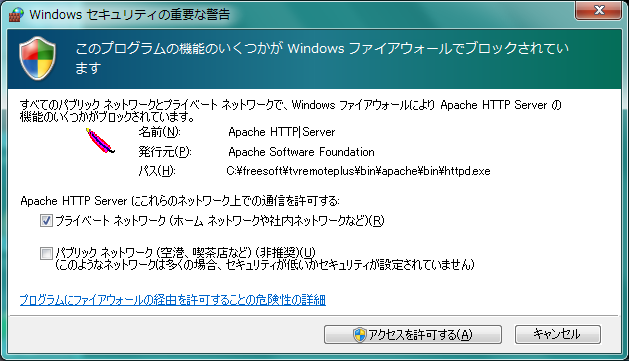
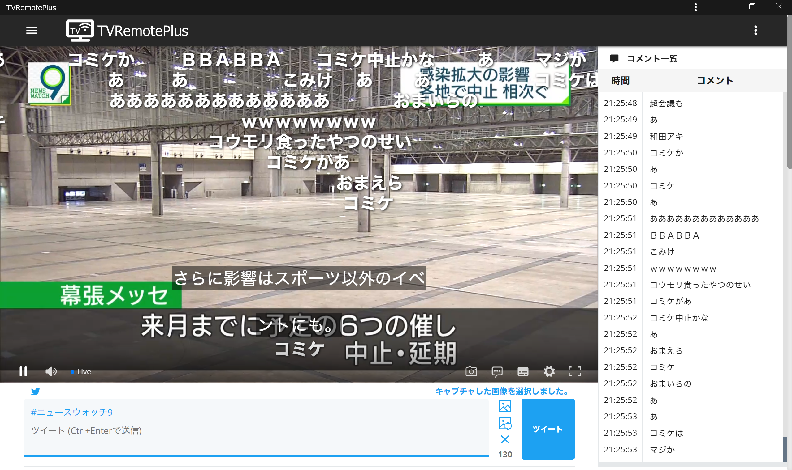

# 

PHP / JavaScript 製のテレビのリモート視聴ソフト（いわゆるロケフリ）です  
YouTube やニコニコなどの動画配信サービスの UI を意識した、モバイルフレンドリーなレスポンシブ Web インターフェイスが特徴です  
Twitter と連携してツイートをキャプチャ付きで投稿する機能や、ニコニコ実況のコメントを表示/投稿する機能、字幕の再生機能、録画番組の検索/再生機能なども実装しています

まちカドまぞくを見るのです…（布教）

## [ダウンロードはこちら](https://github.com/tsukumijima/TVRemotePlus/releases)
## 概要

- [概要](#概要)
    - [開発動機](#開発動機)
- [機能](#機能)
    - [放送中・録画番組の視聴](#放送中・録画番組の視聴)
    - [Twitter へのツイート投稿](#twitter-へのツイート投稿)
    - [ニコニコ実況の再生・投稿](#ニコニコ実況の再生・投稿)
- [セットアップ](#セットアップ)
    - [別途必要なソフト](#別途必要なソフト)
    - [インストール & セットアップ](#インストール--セットアップ)
    - [トラブルシューティング](#トラブルシューティング)
- [使い方](#使い方)
- [PWAについて](#pwaについて)
    - [PWA インストール手順](#インストール手順)
- [Chromecast（Google Cast）機能について](#chromecastgoogle-cast機能について)
    - [注意](#注意)
    - [Chromecast 機能の使い方](#chromecast-機能の使い方)
- [TwitterAPI 開発者アカウントの取得について](#twitterapi-開発者アカウントの取得について)
- [リバースプロキシで外出先からアクセスする（上級者向け）](#リバースプロキシで外出先からアクセスする上級者向け)
- [注意事項・既知の問題](#注意事項既知の問題)
- [利用ソフトウェア](#利用ソフトウェア)
- [動作環境](#動作環境)
- [動作確認](#動作確認)
- [その他・謝辞](#その他謝辞)

スマホ・PC両方においての利用に最適化した使いやすいUIを求め、開発しました。  
一応、コンセプトは「動画配信サイト風の直感的で使いやすいレスポンシブ Web UI 」です。

機能的には TVRemoteViewer_VB と似ている部分がありますが、下記のように TVRemoteViewer_VB にはない機能、逆にこの TVRemotePlus にはない機能もあります。  
また、TVRemotePlus は複数のオープンソースソフトウェア（組み込み済み）を利用して動作します。単体では動作しません。  
この他、当然ながら **予め、いわゆる TS 抜き環境が導入されている必要があります。** 

基本的にド素人が作った出来の悪い自己満ソフトのおすそ分けです。出来る範囲で不具合修正はしますが、動かなくても知りません。  
また、動けばいいや、程度でかなり強引に実装してしまっているため、色々不具合があるかもしれません…

### 開発動機
「布団でゴロゴロしながらスマホでようつべみたいにテレビとか録画とか見たい」  
「ニコ生みたいにニコニコ実況のコメントを流したいしコメントもしたい」  
「Twitter 実況するの割と手順が煩雑になりがちだし見ながら Twitter で実況したい」  
「折角 Twitter 実況するならテレビの画面もキャプチャしてツイートしたい」  
「録画見るときにもコメント流したいしようつべみたいに簡単に見たい（ファイル漁りたくない）」  
「字幕流して放送画面と一緒にキャプチャしてクソリプ画像を量産したい」  

などなど…（不純が過ぎる）

## 機能

細かなものまで列挙しています。  
（要設定）とあるものは予め設定が必要な機能です。  
（予定）とあるものは現在実装出来ていないものの、今後実装する予定のある機能です。  
環境によっては正常に動かない場合もあるかもしれません…

### 放送中・録画番組の視聴
- **基本**
  - HLS 形式による動画配信
  - 番組タイトルの表示
  - EDCB の API を利用した番組情報の表示（要設定）
  - EDCB の API を利用した放送中の他チャンネルの番組情報の表示→視聴（要設定）
  - EDCB の API を利用した放送中の他チャンネルのプログレスバーの表示
  - 番組時間の表示
  - チャンネル名の表示
  - 現在時刻表示（時計）
  - 視聴人数の表示
  - PWA対応（ホーム画面に追加することでネイティブアプリのように利用可能）（要設定）
  - ピクチャーインピクチャー対応
    - かなり新しい技術のため、対応ブラウザは現状 PC と Android 版の Chrome のみです
    - Android 8.0 以降の端末であれば、全画面で再生させた後ホームボタンを押すと自動的にピクチャーインピクチャーモードになります
  - basic認証設定（要設定）
  - ストリーム起動の監視
  - ブラウザからの動作設定
  - Chromecast 等 Google Cast 対応デバイスへのキャスト（暫定実装）
  - 録画ファイルリストの自動更新
  - 複数ストリームの同時配信（予定）
  - 録画している番組の開始が近くなったら通知でお知らせする（予定）
- **動画再生**
  - hls.js を利用したストリームのライブ配信
    - hls.jsの再生に対応していない iOS 端末を除き、諸々の互換性を維持するために  
    ブラウザ側で対応している場合にも全て hls.js を利用して再生させるようにしています
    - そのため、若干再生が重いです
  - フルスクリーンでの再生
  - Web フルスクリーンでの再生
  - 動画のスクリーンショットの保存（PC のみ）
  - b24.js を利用した字幕の表示
    - b24.js は EPGStation にて字幕表示に利用されている js 製ライブラリです
      - 後述の DPlayer に組み込んだ状態でお借りしています
    - hls.js を字幕表示に利用する関係で、hls.js も b24.js 対応のものを利用しています
      - そのため hls.js が使えない iOS 端末では字幕表示機能が利用できません
      - 最近リリースされた iPadOS では使えるらしいです
    - QSVEncC では非対応でしたが、バージョン3.24より対応して頂きました（この場で御礼申し上げます）
    - NVEncC でも同時期に対応して頂いています
  - ニコニコ実況のコメントの再生・投稿（後述）（要設定）
  - 配信休止時の「配信休止中…」動画の再生
  - 配信準備時の「配信準備中…」動画の再生
  - 生放送の同期(● live ボタンを押すと同期されます)
- **動画配信**
  - TSTask を利用したテレビ放送の受信
  - ffmpeg・QSVEncC・NVEncC でのエンコード
  - チャンネルの設定
  - 動画の画質の設定
  - 字幕データの設定
  - 使用 BonDriver の設定
  - コマンドプロンプトからのストリーム開始（隠し機能）
- **録画番組の再生**
  - YouTube 風の視聴動画選択画面
  - ts ファイルの再生
  - mp4 ファイルの再生
  - mp4 ファイルのプログレッシブダウンロード再生
  - mp4 ファイルのダウンロード
  - mp4 ファイルへのエンコード（予定）
  - 録画番組の並べ替え(新しい順・古い順・名前昇順・名前降順)
  - 録画番組の検索
  - 録画番組リストの更新
    - 更新する事で最新の録画番組がリストに反映されるようになります
  - ffmpeg を利用した録画番組のサムネイルの表示
  - rplsinfo を利用した録画番組のタイトルの表示
  - rplsinfo を利用した録画番組の番組情報の表示
  - rplsinfo を利用した録画番組の番組時間の表示
  - 再生履歴の表示
  - 画質を選択して再生
  - ffmpeg・QSVEncC・NVEncC でのエンコード
  - ニコニコ実況の過去ログの再生（要設定）（後述）

### Twitter へのツイート投稿
- **Twitter へのツイート投稿（ TwitterAPI を利用します）（要設定）**
  - テレビを見ながらキャプチャ付きで Twitter 実況が可能です
  - 予め設定ページから TwitterAPI の Consumer Key などを設定しておく必要があります
  - Twitter ログイン・ログアウト機能
  - ツイートの投稿
  - ハッシュタグ付きツイートの投稿
  - ハッシュタグを1分以内に TwitterAPI 経由で連投するとほぼ確実に Twitter 側からシャドウバンされるため、  
  ハッシュタグ付きツイートをしてから1分以内にハッシュタグ付きツイートをした場合に、  
  ハッシュタグを除去してシャドウバンを防止する機能
  - クリップボード内の画像の貼り付け
    - Ctrl + V で出来ますがあまり意味のない隠し機能です
  - Tab キーによるツイート入力画面のフォーカス
    - これも隠し機能です、動くか微妙
  - 動画のキャプチャ付きツイートの投稿
    - Alt + 1 キーでキャプチャできます
    - Mac の場合は Option + 1 キーです
  - ニコニコ実況を含めた動画のキャプチャ付きツイートの投稿
    - Alt + 2 キーでキャプチャできます
    - Mac の場合は Option + 2 キーです
  - ハッシュタグ以外のツイート文や画像などの一括リセット
    - Alt + 3 キーでリセットできます
    - Mac の場合は Option + 3 キーです
  - 字幕を含めた動画のキャプチャ付きツイートの投稿
    - 字幕表示時のみキャプチャの中に含めます

### ニコニコ実況の再生・投稿
- **ニコニコ実況のコメントの再生**
  - ニコニコ生放送のようにコメントが動画上に流れます
  - 本家のコメントの色・位置を再現
  - DPlayer を利用したコメントの表示
    - DPlayer は OSS の JS 製多機能動画プレイヤーです
      - TVRemotePlus 向けに諸々かなり改造を加えた上でお借りしています
      - [こちらのリポジトリ](https://github.com/tsukumijima/DPlayer)に置いてあります
  - DPlayer を利用したコメントの表示・非表示の切り替え
  - DPlayer を利用したコメントの透明度の切り替え
  - ニコニコ実況の勢いの表示
  - コメント一覧表示（ PC のみ）
    - ニコニコ生放送のようにコメントが一覧で流れていきます
    - 画面に流れるのはウザいがコメントは見たい、という場合におすすめです
    - コメント時間(ストリーム開始時から換算)の表示
    - コメント内容の表示
- **ニコニコ実況の過去ログコメントの再生（要設定）**
  - 予め設定ページからニコニコ動画のメールアドレスとパスワードを設定しておく必要があります
  - 当然ながら録画番組再生時はコメントは出来ません
  - コメントの再生
  - コメント一覧表示（ PC のみ）
    - 過去ログ再生時は一気にコメント一覧にコメントが表示されます
    - コメント時間(動画の最初から換算)の表示
    - コメント内容の表示
- **ニコニコ実況へのコメントの投稿（要設定）**
  - ニコニコ動画への API ログイン → Cookie 取得
    - 予め設定ページからニコニコ動画のメールアドレスとパスワードを設定しておく必要があります
  - コメントの色・位置の指定
  - XMLSocket によるニコニコ実況への投稿

## セットアップ

アーカイブは 64bit 版のみです。( BonDriver は 32bit・64bit 両方対応しています )  
技術的には 32bit 版のアーカイブも可能ですが、こちら側でアーカイブを作成するのが面倒なためです。（要望があれば公開するかもしれません）  

### 別途必要なソフト
 - **TVTest**
   - BonDriver の TVTest 用チャンネル設定ファイル（.ch2）が TSTask で必要なためです。
   - また、BonDriver も TVTest と同じものを利用できます。
   - （ないとは思いますが）チャンネルスキャンをしていない場合は、必ずしておいてください。
   - 動作確認済みのアーカイブは [こちら](https://github.com/tsukumijima/TS-Soft-Built/raw/master/TVTest-0.10.0-190808.zip) よりどうぞ。
 - **EDCB + EDCB_Material_WebUI**
   - 番組表の取得に利用します（なくても動作しますが、番組情報が取得できません）。
   - EDCB に加え、[EDCB_Material_WebUI](https://github.com/EMWUI/EDCB_Material_WebUI) を導入しておいてください（素の EDCB だけでは動きません）
   - この他、設定ページにて EDCB Matrial WebUI の API が動作している URL を設定する必要があります。
   - TVRock 等を利用している場合は、別途 TVRemoteViewer 2.93m（再うｐ）版を導入しその URL を設定することで番組表が取得出来るようになります（対応していただき感謝です）。 
   - 動作確認済みのアーカイブ（ EDCB Material WebUI 同梱済み）は [こちら](https://github.com/tsukumijima/TS-Soft-Built/raw/master/EDCB-190814.zip) よりどうぞ。

### インストール & セットアップ

1. Release から最新の TVRemotePlus をダウンロード・解凍します。
2. 解凍したフォルダの中の install.bat を実行し、インストーラー通りに進めます（ CUI ベースですが、比較的簡単にインストール出来ると思います）。
3. 下の「 TwitterAPI 開発者アカウントの取得について」の項目を参考にし、Twitter API アカウントを取得し、アプリケーションを作成します。
   - その後、設定ページの「Twitter 投稿」から、作成したアプリケーションの Consumer Key などを入力して下さい
   - 既に Twitter API アカウントを持っている方、ツイート投稿機能を利用しない方は適宜ステップを飛ばして下さい
4. C:\（TVRemotePlusのあるフォルダ）\bin\TSTask\BonDriver\ フォルダに、いつも TVTest などで使用している BonDriver と、.ch2 ファイル（チャンネル設定ファイル）を入れてください。
   - BonDriver は 32bit・64bit 両方対応しています、インストーラーでどちらかを指定してください
   - BonDriver は Spinel や BonDriverProxyEx 経由で使うと安定性が高くなります
     - Spinel よりも BonDriverProxyEx の方がストリーム開始までの時間が3～5秒ほど速いです
     - BonDriverProxyEx のビルド済みは [こちら](https://github.com/tsukumijima/TS-Soft-Built/raw/master/BonDriverProxyEx-1.1.6.6.zip) よりどうぞ
   - B-CAS カードを内蔵カードリーダーで利用している場合は、WinSCard.dll・WinSCard.ini を TSTask.exe と同じフォルダに入れてください
5. **デスクトップに追加された赤い羽根のショートカットをダブルクリックし、Web サーバーを起動します。**
   - 赤い羽根のアイコンの真っ黒なウインドウが立ち上がりますが、利用する際は立ち上げたままにしておいてください
   - 最小化するのは構いません（デフォルトで最小化した状態で起動します）
6. ブラウザの URL 欄に **http://( TVRemotePlus の動いている PC のローカル IP アドレス):8000/ と入力し、TVRemotePlus の Web アプリへアクセスすると、使えるようになっているはずです。**
7. 画面左上の ≡ サイドメニュー → 設定 → 環境設定 から、適宜必要な箇所を設定します。
   - 今は何も設定しなくても一応動くようにはなっていますが、できるだけ目だけでも通しておいてください。
   - 以前同様に config.php（設定ファイル）を **UTF-8・LFが読み込めるテキストエディタ（メモ帳は出来るだけ避けて下さい）** で開き、直で編集することも可能です。
     - 変更出来たら、**文字コード UTF-8・改行コード LF** で変更を保存します（ Shift-JIS 等 UTF-8 以外の文字コードで保存した場合、最悪動作しなくなります）。
8. 後は適当に使ってください。
   - 比較的頻繁にアップデートします、できるだけ最新の TVRemotePlus を使うことをお勧めします
     - config.php（設定ファイル）は新機能が追加された場合などに変更される事があるため、アップデートでインストールすると動かない場合があります
     - その場合は一旦 config.php を新しいものに置きかえ、設定をやり直してください。
   - もしかするとエラーが出てうまく動かない場合があるかもしれませんが、ほとんどの場合、設定ミスによるものだと思います…
   - PC 起動時に一緒に TVRemotePlus を起動させたい場合は、適宜デスクトップに作成されたショートカットをスタートアップフォルダにコピーし、スタートアップに登録してください
     - エクスプローラーの上のパス入力欄から `%AppData%\Microsoft\Windows\Start Menu\Programs\Startup` と入力すると開けます

### トラブルシューティング　

 - **インストールフォルダや録画ファイルのあるフォルダへのパスに日本語(全角文字)が含まれていると、正常に動きません。**
   - Webサーバー（Apache）や php が日本語フォルダに対応していないためです。
   - もしかすると動くかもしれませんが、基本的にお勧めしません…
   - 例えば、 C:\テレビ\TVRemotePlus\ だとか C:\freesoft\ＴＶＲＰ\ はエラーになります。
   - C:\freesoft\TVRemotePlus\ のように、インストールフォルダへのパスが全て半角英数字で完結するようにしてください。
 - **Web サーバー（Apache）のウインドウがすぐに閉じてしまう場合、何らかのエラーで Web サーバーが起動できていません。**
   - コマンドプロンプトを開き、先程のショートカットを黒いウインドウにドロップし、エラーログを確認してください。
 - **起動する際に下のようなファイアウォール云々が出た場合、許可しておいてください。**
   - 
   - 基本的にはプライベートネットワークのみの許可で構いません（ VPN 等を利用して外部からアクセスする場合は異なってくるかもしれません）。
 - **チャンネル設定ファイルが見つからないため、ストリームを開始できません。と出る場合、TVRemotePlus 側でチャンネル設定ファイルが認識できていません。**
   - チャンネル設定ファイル（.ch2）のファイル名は地デジの場合 BonDriver_(機種名)_T(0-9).ch2、BS・CSの場合は BonDriver_(機種名)_S(0-9).ch2 である必要があります。
   - 例えば BonDriver_FSUSB2N.ch2 のように地デジのみのチューナーで _T や _S が付いていない場合は地デジ用か BS・CS 用か認識出来ないため、BonDriver_FSUSB2N_T.ch2、または BonDriver_FSUSB2N_T0.ch2 のようにしてください。
 - **ブラウザでアクセスしようとすると「 CONNECTION REFUSED 」と出てアクセスできない場合は、Webサーバー（Apache）が起動しているかどうか確認してください。**
   - 赤い羽根のアイコンが Windows のタスクバーにない場合、起動できていないと思われます。
   - 起動しているのにアクセスできない場合は、URL 欄に打ち込んだ TVRemotePlus の動いている PC のローカル IP アドレスが正しいかどうか、確認してください。
   - また、適宜お使いのセキュリティソフトのファイアウォールにて、Webサーバー（Apache）とポート8000・8100へのアクセスを許可しておいてください。
 - install.bat 実行時に **「コンピューターにVCRUNTIME140.dll がないため、プログラムを開始できません。」と出る場合は、[こちら](https://www.microsoft.com/ja-jp/download/details.aspx?id=53587)より Visual C++ 2015 再頒布可能パッケージ をダウンロード・インストールしてください。**
   - vc_redist.x64.exe のみダウンロードし、ダウンロードが終わったら vc_redist.x64.exe を実行してランタイムをインストールしてください。
 - **HTTPS 用 URL でアクセスしようとすると Bad Request と出てアクセス出来ない場合は、URL が本当に https:// になっているかどうか確認してください。**
   - Bad Request は、主に HTTPS（ https:// ）用の URL に HTTP（ http:// ）でアクセスしようとした際に起こるエラーです。
   - ちなみに HTTP 用の URL に HTTPS でアクセスしようとすると、「192.168.x.xx から無効な応答が送信されました。」のようなエラーが発生します。
 - **TVRemotePlus は通常、ポート 8000・8100・8200～8210あたり を使用します。**
   - ポート 8000 … HTTP アクセス用
   - ポート 8100 … HTTPS アクセス用
   - ポート 8200～8210あたり … TSTask での UDP 送信に利用
   - ffmpge・QSVEncC・NVEncC といったエンコードソフトが落ちてしまう場合は、ポートがバッティングしている可能性があります。
     - HTTP・HTTPS アクセス用ポートは初回インストール時に変更可能です（ HTTPS アクセス用ポートは HTTP アクセス用ポート + 1000 になります）。
     - TSTask での UDP 送信用ポートは 設定ページ にて変更可能です。
 - ストリーム開始フォームの チャンネル もしくは 使用BonDriver の項目が空の場合は、**TSTaskの中の BonDriver フォルダに BonDriver や .ch2ファイル が入っているかを確認してください。**
   - それでも読み込めていない場合、.ch2ファイルがこちらの想定しているものと違っている可能性があります（不具合報告していただけると助かります）。
   - TSTask.exe のあるフォルダに BonDriver や .ch2ファイル を置いた場合、認識されません。
 - サーバー PC にすでに php がインストールされていてシステム環境変数にも登録されている場合で、TVRemotePlus の php（7.3.6）とバージョンが異なっている場合、Apache（Webサーバー）がエラーウインドウを出して正常に起動できない事があるようです。
   - 既に入っている php へのパスがシステム環境変数に登録されていると、そちらの php の dll を優先して読み込もうとする（？）からか、php.exe と 関連　dll のバージョンが違うとそこでエラーが発生するようです…
   - できるだけ、既に入っている php はシステム環境変数から除外するか、既に入っている php を TVRemotePlus と同じバージョン（php7.3）に揃えるようにしてください。

## 使い方

 - TVRemotePlus を起動する際は、デスクトップにある赤い羽根のアイコンをダブルクリックで起動させ、利用中はそのままにしておいてください。
 - ブラウザの URL 欄に http://( TVRemotePlus の動いている PC のローカル IP アドレス):8000/ と入力し、TVRemotePlus の Web アプリへアクセスします。
   - 毎回打つのは面倒なため、ショートカットに登録しておくことをおすすめします。
 - 再生ページの下のチャンネル一覧から見たいチャンネルを選び、「ストリーム開始」をクリック・タップします。
 - ファイル再生の場合、サイドメニュー →「ファイル再生」から、見たいチャンネルを選び、「再生する」をクリック・タップします。
 - 左上のボタンを押すと、サイドメニューが開きます。
   - 設定ボタンは実装出来ていませんでしたが、v1.0.0-rc14 より実装しました。
 - 右上のボタンを押すと、サブメニューが開きます。ChromeCast でのキャストや録画ファイルリストの手動更新などに利用します。
   - v1.0.0-rc18 から(ようやく)ファイルが増減した際に自動で更新するようになりました。
   - うまく更新されない場合は、サブメニュー →「リストを更新」をクリック・タップし、録画ファイルリストに反映させてください。
   - リストの更新には時間がかかる事があります（ v1.3.0 より更新処理が大幅に高速になりましたが、それでも録画ファイル数が多いと数分かかる事があるかもしれません）
   - 「リストを更新」をクリック・タップした後は、タブを閉じてもそのままバックグラウンドで処理が継続されます。
   - また、サブメニュー →「リストをリセット」をクリック・タップすると、録画ファイルリストをリセットします。うまく番組情報が取得できなかった際などに使ってください。
 - 隠し機能ですが、コマンドプロンプトに、
    - (TVRemotePlusをインストールしたフォルダ)\stream.bat ONAir (ストリーム開始するチャンネル番号)
      - と実行すると、指定したチャンネルが自動でストリーム開始されます。
    - (TVRemotePlusをインストールしたフォルダ)\stream.bat ONAir (ストリーム開始するチャンネル番号) (動画の画質) (エンコード) (字幕データ) (使用BonDriver)
      - のように、詳細に指定することもできます。
    - (TVRemotePlusをインストールしたフォルダ)\stream.bat Offline
      - と実行すると、自動でストリーム終了されます。
   - これを利用し、タスクスケジューラ等に登録しておくと、指定した時間に自動でストリームが起動/終了できるようになります。
 - TVRemotePlus を終了する際は、赤い羽根のアイコンの黒いウインドウを閉じてください。

## PWAについて

PWA（ Progressive Web Apps ）とは、

 - **アプリアイコンをデスクトップやホーム画面に追加してそのショートカットから起動出来る**
 - **ブラウザバーを気にせず大きな画面で使える（上の画像を参照）**
 - **起動時に数秒スプラッシュ画面が表示される（ iOS・Android のみ）**
 
など、**Webアプリをローカルアプリのように利用できる新しい仕組みのことです。**  
有名なサイトでは Twitter（新 UI 版）が対応しています。  
TVRemotePlus は、PWA に対応しています。    

しかし、PWA を利用するためには、HTTPS 通信が必須です。そのため、インストール時に予め HTTPS 通信用の自己署名証明書（いわゆるオレオレ証明書）を作成・有効にしてあります。  
自己署名証明書を信頼させ、お使いの端末で PWA を利用するためには、端末に自己署名証明書自体をインストールさせておく必要があります。  
証明書のインストール後、TVRemotePlus と HTTPS でアクセス出来るようになれば、PWA 機能が利用出来るようになります。  
また、PWA は Windows・Mac・Android は Chrome 、iOS では Safari が対応しています。

### PWAのインストール手順
 1. まず、PWAを利用したい端末で **http://( TVRemotePlus の動いている PC のローカル IP アドレス):8000/server.crt** にアクセスし、証明書をダウンロードします。
 2. その後、ダウンロードした証明書を開き、端末にインストールします（この時、表示が「CA 証明書」になっているかどうかを確認してください）。
 3. インストール後、Chrome または Safari が立ち上がっていれば一旦タスクを切ってからブラウザをもう一度起動します。
 4. **https://( TVRemotePlus の動いている PC のローカル IP アドレス):8100/** にアクセスし、アドレスバーに鍵マークが正常についていれば、証明書の導入は完了です。
    - この時に必ず https:// を付けてアクセスしてください（ https:// を付けないと http:// と判定されてしまいエラーが出ます）
 5. ブラウザのメニュー等から **「ホーム画面に追加」または「 TVRemotePlus をインストール」すると、ネイティブアプリのように利用できるようになっているはずです。**
 6. Android の場合、何故かスプラッシュ画面のアイコンが小さい場合がありますが、原因は不明です（ Chrome の自動推定のせいらしいですが…）
 7. iPhone・iPad の場合、Safari であれば自己署名証明書をインストールしなくても http://( TVRemotePlus の動いている PC のローカル IP アドレス):8000/ から「ホーム画面に追加」する事でインストールできるみたいです…
    - ただし、自己署名証明書をインストールしない場合、Service Worker に依存する機能は使えないらしいです（現状 Service Worker の機能は使っていないため問題はありません）

## Chromecast（Google Cast）機能について

Chromecast（Google Cast）機能は、Chromecast・AndroidTV・Google Home・Google NestHub など、 **GoogleCast に対応した端末に「キャスト」する事ができる機能です。**（暫定実装）  
この機能を使うと、Chromecast が刺さったテレビや AndroidTV であれば、TVRemotePlus で配信しているストリームをテレビの大画面で視聴することができます。  
テレビで再生させるのであれば「普通に見ればええやん」となるかと思いますが、**録画した番組（ファイル再生）もキャストさせる事ができます。**  
TS 抜きチューナーで録画した番組を普通のテレビで気軽に見る事ができるので、割と便利だと思います  
（私もほぼファイル再生にしか使ってません…・東京の実家にチューナーを置いて地方で見てる、という方とかにはいいかもしれません）

### 注意
  - **やろうと思えば出来るとは思いますが、現状コメントや字幕の再生には対応していません…**
    - 手元のスマホにはコメントや字幕が流れるので、スマホのコメントや字幕を見ながらテレビで録画を見るのもありかもしれません
    - Chromecast 周りは本当に情報が不親切な Google の英語ドキュメントくらいしかないので実装するやる気が…
  - **Chrome ネイティブのキャスト機能を使う場合、上の PWA のセットアップ手順を参考に、HTTPS でアクセスするようにしてください。**
    - HTTP の場合 Chrome ネイティブのキャスト機能が使えないので、無理やりキャストする方でキャストします
    - Chrome ネイティブのキャスト端末選択画面ではない場合はその辺りも疑ってみてください
    - リバースプロキシで外部からアクセスする（後述）場合、ドメインが違うからか HTTPS 化していたとしても Chrome ネイティブのキャスト機能が使えません（色々調べたんですがお手上げ…）  
  - Windows10 1809 以前では、デバイスがスキャン出来ない不具合があるようです（詳細は後述）
    - Windows 標準の mDNS を無効化して Bonjour をインストールするか、Windows10 1903 以降に更新してください
    - Windows10 1903 では標準で mDNSが機能するため、Bonjour を入れる必要はないかもしれません
  - 使い方とか見てれば分かると思いますが、正直かなり動くか微妙なので、暫定実装としています

### Chromecast 機能の使い方
1. テレビの前にスマホ（もしくは PC ）を持っていき、TVRemotePlus を開きます。
2. 再生したいチャンネルや録画ファイルをストリーム開始し、スマホで Chromecast 等で再生したいチャンネル/番組が再生できる状態にします。
3. 右上のサブメニューを開き、「キャストを開始」をクリックします。
4. **PC / Android の Chrome であれば Chrome ネイティブのキャスト機能、対応していないブラウザではサーバー側から無理やりキャストするような実装としています。**
5. PC / Android の Chrome の場合、**同じ Wi-Fi ネットワーク上にあるキャストに対応した端末が表示されるはずなので、それをタップするとキャストが開始されます。**
   - Google Home などのスピーカーしかついていない端末の場合、音声のみ再生されます
6. その他のブラウザの場合、初回キャストの場合は同じサイドメニューから「デバイスをスキャン」をタップし、**予め Wi-Fi 上のキャスト対応端末をスキャンしておく必要があります**
   - サーバー側からのキャスト機能を使う場合、**予め Bonjour という mDNS に対応させるためのソフトを別途インストールしておく必要があります**
     - iTunes の中に入っています
     - キャスト対応端末をスキャンするのに利用します
   - Google Home などのスピーカーしかついていない端末への再生には対応していません（うまく再生できなかったので表示しないようにしています）
   - また、TVRemotePlus サーバー上でスキャンするため、当然ながらキャストできるのはサーバーのあるローカルネットワーク上のキャスト対応端末のみとなります
   - スキャンさせる際は **TVRemotePlus（Apache）を管理者権限で実行させてください**（ Bonjour サービスを再起動させた直後にスキャンしないとうまく行かないらしいので…）。
   - 正直、**スキャン機能は動くかどうか非常に微妙です**（元々が無理やりなので…）
   - **基本的に機能としては Chrome ネイティブの方が上位互換なので、出来るだけ https でアクセスした上で Chrome にて再生させる事をおすすめします**
     - 非対応ブラウザ向けに以前作った無理やりな実装を残しているだけなので…
   - Bonjour をインストールしたのにスキャン出来なかったりする場合もあります、前述した不具合でない場合は、正直お手上げです…
   - CastV2inPHP というライブラリを使用しています（ありがとうございます）
7. その他のブラウザの場合、スキャンが正常に完了すると、**キャスト対応端末が表示されているはずなので、それをタップするとキャストが開始されます。**
   - キャストを開始すると、再生させていた動画がブラックアウトし、「（キャストしている端末名）で再生しています」と表示されるはずです
8. **プレイヤー上で再生・停止・シーク・音量調整（ PC のみ）させると、Chromcast で再生しているストリームも同期して反映されます。**
   - 微妙に動作にズレが生じますが、これでも相当頑張ったんです…（相当試行錯誤しました）
   - Chrome ネイティブのキャスト機能の方が綺麗に同期されているはずです（無理やりの方は同期出来ていません）
   - 操作方法自体は YouTube をキャストさせる時とさほど変わらないと思います
9. キャストを終了する場合、**もう一度右上のサブメニューを開き、「キャストを終了」をタップする**（ Chrome ネイティブのキャスト機能の場合はキャストしているデバイスが表示されるので適宜終了させる）と、キャストを終了できます
   - キャストを終了すると、動画が元に戻り、ミュートも解除されて音が出るはずです
   - 念の為、リロードしておくと良いかもしれません

## TwitterAPI 開発者アカウントの取得について
長くなるため別ページにまとめています。  
[Twitter_Develop.md](docs/Twitter_Develop.md)

## リバースプロキシで外出先からアクセスする（上級者向け）
長くなるため別ページにまとめています。  
[Reverse_Proxy.md](docs/Reverse_Proxy.md)

 
## 注意事項・既知の問題
 - 端末のスペックにもよりますが、基本的に処理が重たいです（コメント表示時は特に…）。コメントが多くなると固まる場合もあります…
   - コメントが多すぎて重い場合、プレイヤーの設定にてコメント表示をオフにすると軽くなります
 - 現状、スペックやその時々の状況によっても変わりますが、仕様上ストリーム開始（チャンネル切り替え）に5～20秒程度掛かります…
 - エンコードソフトの仕様（？）で、字幕データオン時に字幕がない番組を配信させている場合・CMに切り替わった場合に、何故かエンコードが数秒止まる事があります。
   - そのため、再生時に数秒カクついているように見える場合があります
   - 字幕のない番組を配信させる際は字幕データをオフにしておく事をおすすめします
   - なお、録画番組再生時はそのような不具合は確認されていないため、デフォルトでは字幕データをオンとしています
     - もし録画番組のエンコードが途中で止まってしまった場合は、一度字幕データをオフにして再生してみてください
   - 字幕自体の表示はプレイヤーの設定で切り替えられます、字幕が要らない場合はオフにしてください
 - 配信準備中…からストリームにうまく移らない・再生が止まった などの時は、時計表示をクリック・タップしてください。リロードされます。
 - TSTask は後述の無理やり taskkill させる関係上、クライアントプログラムを起動させないオプションで起動させています。
   - 立ち上がってるか心配な場合、タスクマネージャーで調べるか別途 TSTaskCentre を起動させるといいと思います
   - ffmpeg・QSVEncC・NVEncC は独立ウインドウにて最小化した状態で起動します
 - ニコニコ実況にコメントを投稿する場合、数秒遅延している事を念頭に入れた上でコメントしてください…（それほど気にならないとは思いますが…）
 - 同梱している動作に必要なソフトウェア（後述）は全て TVRemotePlus 向けに設定やフォルダ構成等を最適化してあります。

## 利用ソフトウェア
動作に必要なソフトウェアをお借りしています。この場で御礼申し上げます…  
全て配布アーカイブの中に組み込んでいますが、BonDriver 周りは各自で用意し、別途 (TVRemotePlusをインストールしたフォルダ)\bin\TSTask\BonDriver\ に入れてください。
また、QSVEncC を利用する場合は Intel QSV に対応した CPU が、NVEncC を利用する場合は NVIDIA GPU が必要です。

- Apache（ v2.4.39・Webサーバ）
- php（ v7.3.6・実行環境）
- TSTask（ v0.2.0(patch)・テレビ放送の受信、UDP 送信に利用）
- rplsinfo（ v1.5・TSファイル内の番組情報取得に利用）
- ffmpeg（ v4.1.4・UDP 受信 → エンコードに利用）
- QSVEncC（ v3.24・UDP 受信 → ハードウェアエンコードに利用）
- NVEncC（ v4.54・UDP 受信 → ハードウェアエンコードに利用）

## 動作環境
  - サーバー：**Windows7 以上（のはず）・64bit**
    - 32bit でも動くとは思いますが、恐らく 64bit の環境が殆どだと思います。
    - そのため、配布アーカイブに同梱されているソフトは全て 64bit 版で組み込んでいます。
    - Linux 版はこちらに環境がないので難しいですが、Web ベースなので（番組表とストリーム開始周りがどうにかなれば）移植する事自体は可能だと思います。
  - クライアント：**最新の Chrome・Firefox・Safari など**
    - **Chrome を強く推奨します。**
    - Opera・Vivaldi などはブラウザエンジンが Chrome（ Blink ）なので Chrome とみなします。
    - 当然ながら **IE と Edge はサポートしていません。**（滅びろ） 
    - iOS 端末ではブラウザエンジンが Safari 以外利用できないらしく、  
    一部正常に動作しない機能があります。
      - iOS 版 Chrome・Firefox の内部ブラウザエンジンは Safari です。
      - Mac は Chrome が使えるのでそっちを使ってください（そこまで手が回らない…）
    - キャプチャ付きツイートの投稿機能は、**Android 版 Firefox・Mac 版 Safari では対応していません。**（ブラウザのバグによるエラーでキャプチャに失敗します）
      - 動画のキャプチャはブラウザの仕様に依存する上、ブラウザ側のバグが非常に多いため、基本的に最新の Chrome を利用してください。
    - 古い Android 端末では、コメント描画が重くなる場合があります。
      - コメント描画中にキャプチャする場合、キャプチャ画像の取得に時間がかかる場合があります。
      - 最新の端末でも、（スペックにもよりますが）コメントが多く流れているとキャプチャに少し時間がかかります。

## 動作確認
  - サーバー：Windows7 Professional 64bit + PLEX PX-Q3PE4
    - PX-Q3PE4 の兄弟機種である PX-W3PE4・PX-W3U4・PX-Q3U4 でも同様に使えると思います。
    - PT 系はこちらに環境がないので微妙です…
    - 首都圏での利用を前提で開発しています。
      - （確かめようがないのですが）もしかすると、地方では一部動作しない箇所があるかもしれません…
    - CS も一応対応していますが、こちらに環境がないのでなんとも言えないです…
      -  スカパープレミアム（SPHD）は無理だと思います…
  - クライアント：
    - Windows・Mac
      - Chrome
    - Android
      - Chrome
      - Opera
    - iOS
      - Safari
      - Chrome

## その他・謝辞
詳しくない方でも出来るだけ簡単にセットアップ出来るようにしたつもりですが、  
ソフトの性質上、どうしても一部難しい箇所や環境によってうまく動かない箇所があるかもしれません…

また、このソフトを利用して起こったいかなる不利益も、私（開発者）は一切の責任を負いかねます。あくまで自己責任にて利用してください。  
改変・再配布等はお好きにどうぞ（改変ソースは個人的に取り入れる事があります）。  
Issue か 5ch のロケフリスレ にて不具合報告などは受け付けておきます。

TVTest（NicoJK）・TVRemoteViewer_VB・EDCB_Material_WebUI・EPGStation など、数多くの先駆者様・ソフトウェア・サイト、  
また様々なネット上の文献を参考にし、ここまで作り上げる事ができました。  
ch_sid.txt は NicoJK にて使われていたものをチャンネル名を現在の情報に修正した上で使わせて頂いています。  
TVRemotePlus の字幕表示機能は EPGStation に使われていた b24.js を DPlayer に組み込んで使わせて頂いています。  
また、QSVEncC・NVEncC の作者の rigaya 様にはエンコード時の字幕対応等で多大な協力を頂きました。  
この場で厚く御礼申し上げます。本当にありがとうございました！

## License
[MIT Licence](LICENSE.txt)
